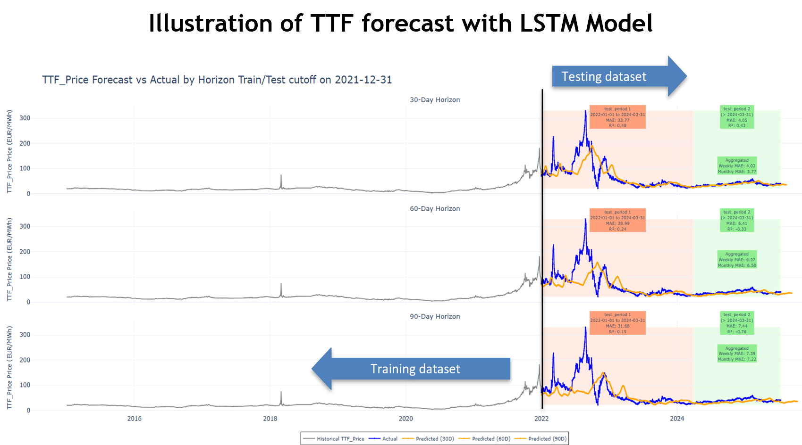

# LNG Price Forecasting & Trade Profitability Simulation  
A data-driven tool to support smarter LNG trading decisions

## **Author**
[Juan Zhang](https://www.linkedin.com/in/juan-zhang-finance-professional/)

## **Supervisors**  
[Ekaterina Butyugina](https://www.linkedin.com/in/ekaterina-butyugina/),  
[Albin Plathottathil](https://www.linkedin.com/in/albin-plathottathil/)

---

## **Overview**

In the fast-moving world of global energy markets, agility and data-driven insight can make or break a trade.  
LNG traders must evaluate volatile benchmark prices, shifting demand across European terminals, complex regasification cost structures, and multi-step voyage economics — often under time pressure.

To address these challenges, I developed a **deep-learning forecasting engine** combined with a **Streamlit simulation tool** that helps traders:

- Forecast LNG benchmark prices (TTF, PVB, Henry Hub, JKM)  
- Simulate netback & profitability for each regasification terminal  
- Adjust key cost drivers to explore sensitivity scenarios  
- Visualize projected market conditions and route economics interactively

This project was completed as part of the Constructor Academy Data Science & AI Bootcamp and later refined into a standalone portfolio project.

---

## **The Problem**

Assessing LNG trade profitability is difficult because traders must integrate:

- Highly volatile benchmark prices  
- Dynamic regasification and freight cost structures  
- Point-in-time spreads between terminals  
- Sudden geopolitical disruptions  
- Manual spreadsheets and slow recalculation cycles  

This leads to **time-consuming**, error-prone analysis and lost opportunities.

---

## **The Solution**

### **🔮 1. Deep Learning Forecasting Model**  
A custom LSTM-based forecasting engine predicts LNG benchmark prices across:

- **30-day**
- **60-day**
- **90-day**

horizons for:

- **TTF (EU)**  
- **PVB (Spain)**  
- **Henry Hub (US)**  
- **JKM (Asia)**  

Key features include:

- Flexible **lookback window** tuning  
- Feature-engineered inputs (returns, rolling std, z-scores, Bollinger width, etc.)  
- Regime-based validation (pre- and post-war)  
- Metrics: **MAE**, **R²**, and horizon comparisons  

The model is optimized to remain stable under market shocks and shifting volatility regimes.

---

### **📈 2. Streamlit Application for Scenario Simulation**

The Streamlit app (see `app.py`) integrates forecasting outputs with a profitability simulator.

Traders can:

- **Simulate netback & net profit** for each destination terminal  
- Adjust key inputs (benchmark price, regas fees, freight, fuel loss, cargo costs)  
- Compare terminals via interactive bar charts  
- Visualize route economics with a **waterfall profit breakdown**  
- Explore actual vs. predicted price curves across horizons  

This transforms complex trade evaluation into a quick, intuitive workflow.

---

## **Illustrations**

### **LNG Trading Flow & Profitability Concept**
<p align="center">
  
</p>

### **LNG Forecast Model Output Across Multiple Horizons**
<p align="center">
  
</p>

---

## **Data**

The `data/` directory contains datasets used in this project, including:

- Historical LNG benchmark prices  
- Freight & regasification cost components  
- Weather and temperature indicators  
- Technical time-series features  

Raw data originates from publicly available sources and internal market reports.

---

## **Models**

The `models/` directory includes trained LSTM models for each horizon and index.

---

## **Notebooks**

The `notebooks/` folder documents the full pipeline:

- Data preprocessing  
- Exploratory analysis  
- Feature engineering  
- Model training & hyperparameter tuning  
- Validation and horizon comparison  

---

## **Streamlit Application**

The interactive user interface is implemented in:

- `app.py`

It consists of two main tabs:

1. **Destination Netback & Profit Simulation**  
2. **Forecast Prices Panel**

Run the app locally with:

```bash
streamlit run app.py
